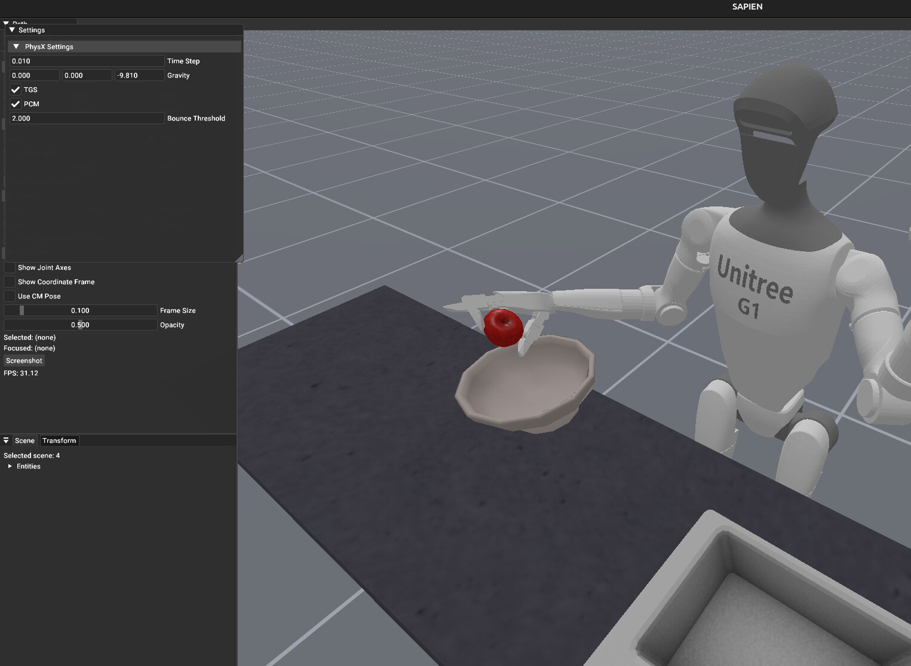
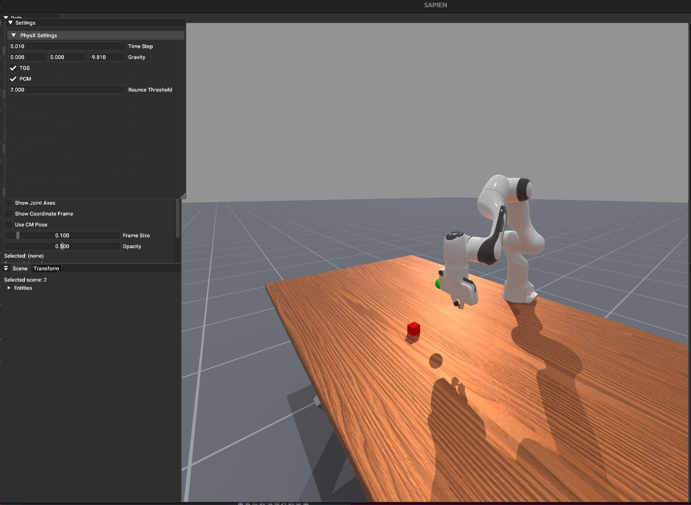
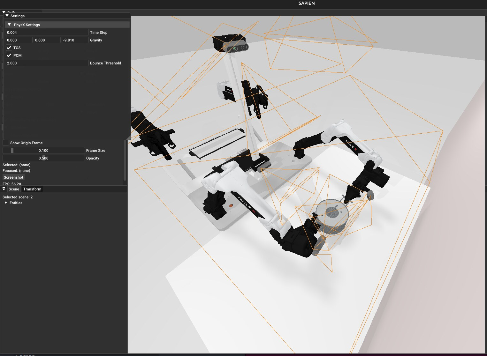

# sapien-experience

**SAPIEN 系机器人操作仿真一键预览** —— 把两个基于 [SAPIEN](https://sapien.ucsd.edu/) 的标杆项目收成 submodule,各配一个双语、一键的 Jupyter 预览本。

_One-click previews for two SAPIEN-based robot-manipulation benchmarks, each as a submodule with a bilingual notebook._

| Benchmark | 一键本 / Notebook | 看点 / Highlights | env |
|---|---|---|---|
| [ManiSkill 3](https://github.com/haosulab/ManiSkill) (RSS'25) | [`ManiSkill.ipynb`](ManiSkill.ipynb) | GPU 并行仿真 · 多机器人 · 运动规划真解 · 光追 · RL | `maniskill` |
| [RoboTwin 2.0](https://github.com/RoboTwin-Platform/RoboTwin) (CVPR'25 Highlight) | [`RoboTwin.ipynb`](RoboTwin.ipynb) | 双臂专家求解 · 50 任务 · 域随机化 · 数据生成 | `robotwin_sx` |

---

## 画廊 / Gallery

### ManiSkill — Unitree G1 强化学习策略 / RL policy
我们用 PPO(纯奖励、无数据集)训了 G1「把苹果放进碗」。它学会双臂伸手抓取(return 3→50),但卡在松手放置——典型塑形奖励局部最优。Checkpoint 已入库:[`checkpoints/g1_placeapple/`](checkpoints/g1_placeapple/)。

_PPO (reward-only, no dataset) policy for G1 placing an apple in a bowl. Learns to reach & grasp, stalls at the release._



### ManiSkill — 光线追踪渲染 / Ray-traced rendering
`--shader rt` 路径追踪渲染器,照片级画质(真实木纹 + 柔和阴影)。



### RoboTwin — 双臂专家求解 / Dual-arm expert
Aloha-AgileX 双臂在 curobo + mplib 专家规划器下现场求解(无需训练 / 数据)。下图为 `lift_pot`(橙色为相机视锥)。

_Aloha-AgileX solving a task live via the curobo + mplib expert planner — no training, no data._



---

## 快速开始 / Quick start

```bash
git clone --recurse-submodules <this-repo>
cd sapien-experience

# ManiSkill: 装 env(含 numpy<2 + mplib 段错误修复)
bash scripts/install_maniskill_env.sh
jupyter lab ManiSkill.ipynb

# RoboTwin: 装独立 env robotwin_sx(官方 py3.10 pins + curobo fortify 修复)
bash scripts/install_robotwin_env.sh
jupyter lab RoboTwin.ipynb
```

> 两个 notebook 的 GUI 预览需要显示器(`DISPLAY=:0`)。RoboTwin 首次装 ~30-60 min(curobo CUDA 编译 + ~16GB 资产)。

## 目录 / Layout

```
ManiSkill.ipynb / RoboTwin.ipynb   一键预览本 / one-click notebooks
scripts/
  install_maniskill_env.sh         幂等装 maniskill env
  install_robotwin_env.sh          幂等装 robotwin_sx env(可 ROBOTWIN_ENV 覆盖名)
  maniskill_demo.py                status / list 内省
  robotwin_demo.py                 list / preview(专家求解 GUI)/ collect
  g1_eval_gui.py                   G1 PPO 策略 live GUI eval
checkpoints/g1_placeapple/         入库的 G1 PPO checkpoint(1.2MB)
doc/assets/                        README 截图(jpg)
dependencies/                      ManiSkill / RoboTwin submodules
```

## 平台踩坑(已固化进安装脚本)/ Platform gotchas (baked into installers)

1. **ManiSkill mplib 段错误** — numpy 2.x ABI 撞 mplib 0.1.1 → 钉 `numpy<2` + `opencv<4.12`
2. **curobo 编译失败** — 系统 CUDA 12.0 撞 Ubuntu 24 glibc 2.39 → `_FORTIFY_SOURCE=0`
3. **RoboTwin 段错误** — 非标准 py3.12/torch2.10 env 在 `convert_physx_component` 崩 → 用官方 py3.10/torch2.4.1 干净 env(`robotwin_sx`)

详见各 notebook 与 [`scripts/`](scripts/)。
